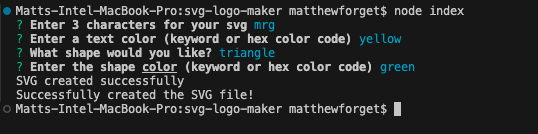
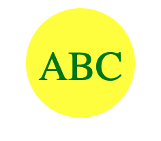
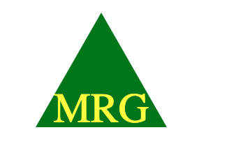

# SVG Logo Maker

## Purpose of the Project

This prompts a user to select what shape they would like and for them to enter 3 characters to fill into the shape. I also allows the user to enter a color or hex color code to fill in the shape.

## Acceptance Criteria

```md
GIVEN a command-line application that accepts user input
WHEN I am prompted for text
THEN I can enter up to three characters
WHEN I am prompted for the text color
THEN I can enter a color keyword (OR a hexadecimal number)
WHEN I am prompted for a shape
THEN I am presented with a list of shapes to choose from: circle, triangle, and square
WHEN I am prompted for the shape's color
THEN I can enter a color keyword (OR a hexadecimal number)
WHEN I have entered input for all the prompts
THEN an SVG file is created named `logo.svg`
AND the output text "Generated logo.svg" is printed in the command line
WHEN I open the `logo.svg` file in a browser
THEN I am shown a 300x200 pixel image that matches the criteria I entered
```

## Requirements to Run

Node is required to run

With this project and in the terminal, run `npm install` and then `node index` to start the prompt

## Testing Suite

Test will run 3 tests. Each test will pass by making a Triangle, a Square, and a Circle set of svgs.

To run the test, `npm run test` will execute the tests.

## Location of Code

- [GitHub Repo](https://github.com/mgordon82/svg-logo-maker)
- [Demo Video](https://mgordon82.github.io/svg-logo-maker/images/demo-recording.mov)

## Screenshots







